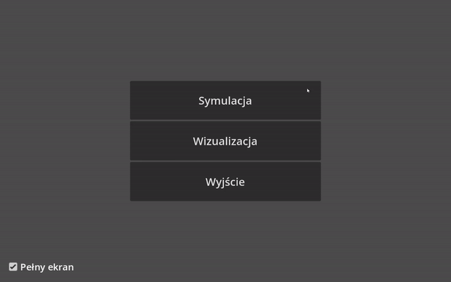
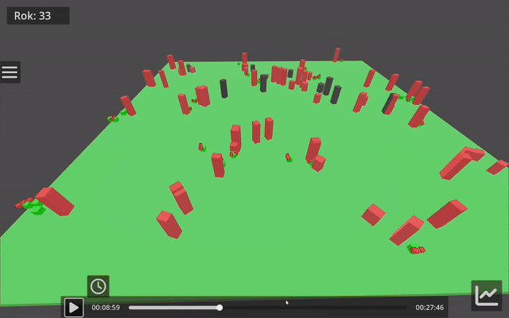

# Evolution Simulation and Visualization

An agent-based evolution simulation with an interactive graphical representation of the simulation and its results.

## Overview
### Simulation
First, a simulation must be conducted. To do this, simulation parameters must be selected.



When the simulation ends, its results will be saved in binary format next to the executable file. With that file the visualization can be run.

### Visualization

The visualization provides two complementary ways of exploring a simulation:

- Live visualization - observe individual agents, their behaviour, reproduction, genes, and changes within the population.


- Statistical analysis - view statistics collected throughout the simulation execution.



The main focus of the visualization is to make evolutionary processes easy to understand at a glance, especially the way advantageous genes spread through a population over generations.

## How the simulation works
The simulation is based on classical genetic algorithms, but uses genes represented by floating-point numbers and does not have a strictly defined mathematical fitness function. Instead, fitness emerges from the agent-based simulation. This is a result of the fact that genes determine corresponding traits or behaviours.

During reproduction, there is a random chance of applying classical genetic algorithm operators - crossover and mutation - to determine the offspring's genes. The probability of applying these operators is set in the simulation settings. Crossover involves splitting the gene arrays (also called chromosomes) of both parents at the same position and creating an offspring chromosome by combining corresponding parts from each parent. Mutation is a random change to a single gene within a range determined by a normal distribution configured in the simulation settings. These operators ensure some diversity in the population's gene pool.

Individuals with traits and behaviours that allow them find food and reproduce more effectively, reproduce more often than individuals that fare worse. As a result, their genes spread through the population and displace other variants. That's evolution, baby ;).

## Technologies
- C#/.NET - simulation.
- Godot - visualization and UI.

## Installation
You can run the app in two ways:
### 1. Download build
Go to the Releases page and download a build ready to run. There is no need to install anything to launch the app. Just download and run the executable file.
### 2. Set up the development enviroment
#### Requirements
- [Godot Engine 4.3 with .NET support](https://godotengine.org/download/archive/)
- [.NET 6 SDK](https://dotnet.microsoft.com/en-us/download/dotnet)
#### Clone the repository
```bash
git clone https://github.com/Ktos1/Evolution-Simulation-and-Visualization.git
```
#### Open the project
1. Launch Godot
2. Import the project into Godot
3. Build and run the app

## How to use
1. In the simulation panel, select parameters and click Start. After a simulation has finished, simulation results will be saved to result.bin next to the executable file. You can copy this .bin file to keep the record of a specific simulation.
2. With result.bin, click the Visualization button. The simulation record will then be loaded, so give it a moment. At this point, the statistical plots are also generated and saved in the Plots folder. You can copy them if you want to keep them .
3. In the visualization scene, you can:
    - move the camera with WASD and look around with the mouse
    - move the camera faster holding SHIFT
    - zoom with the scroll wheel
    - view an individual's genes by clicking on it
    - scrub through a simulation by clicking on the clock button
    - analyse population statistics by clicking chart button

## License
This project is licensed under the GPLv3 License.
